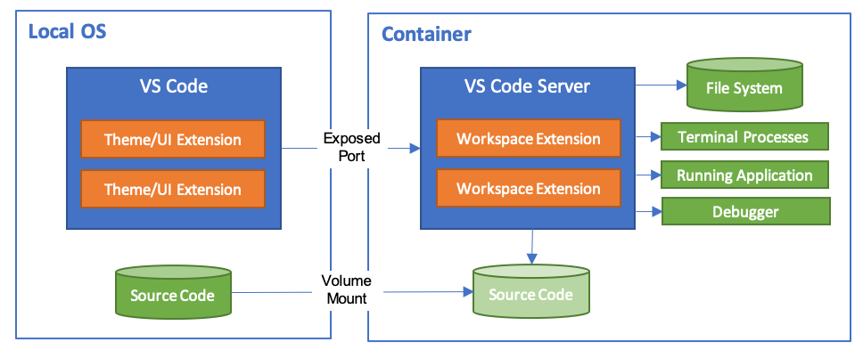

# vue-cli-plugin-vscode-remote

<p align="left">
    <a href="https://npmcharts.com/compare/vue-cli-plugin-vscode-remote?minimal=true"></a>
    <a href="https://www.npmjs.com/package/vue-cli-plugin-vscode-remote"></a>
    <a href="https://www.npmjs.com/package/vue-cli-plugin-vscode-remote"></a>
</p>

Vscode Remote plugin for `@vue/cli` 3.0.

### About

The Visual Studio Code Remote - Containers extension lets you use a Docker container as a full-featured development environment. It allows you to open any folder inside (or mounted into) a container and take advantage of Visual Studio Code's full feature set.



[more about](https://code.visualstudio.com/docs/remote/containers#_getting-started)

### Install

First you need to install `@vue/cli` globally (follow the instructions [here](https://cli.vuejs.org/)).

Then create a project and add the Element plugin:

```bash
vue create my-app
cd my-app
vue add vscode-remote
```

You'll be asked some questions regarding how vscode remote is configured in your project. After that, you're good to go.
